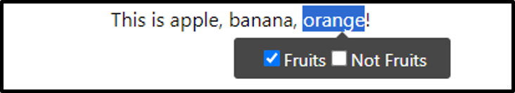

# Word Tagger

This is React Tag Editor for Tagging words. You can visually check and edit the tagging of words, and receive tagged information.
When you drag the word you want to tag in Tag Editor, the tag tooltip appears at the below, and when you select the tag, the word is tagged.

## Installation

    npm install word-tagging

## How to Use

    import  React from  'react';
    import {TagEditor} from  'word-tagging';
    
    function  App() {
    
	    const  tags = [
	        { name:  "Name" },
	        { name:  "Gender" }
	    ]
	    
	    function  onChange (info) {
		    console.log(info)
	    };
	    
	    function  onClickTag(name, word, tagged) {
		    console.log(name, word, tagged)
	    }
	    
        return (
    		    <TagEditor value="This is apple, banana, orange!"  tags={tags}  />
    	    );
        }
    
    export  default  App;

## API

| Property | Description | Type |
|--|--|--|
| value | Sentence to tag | String |
| tags | Information about tags. It should be of type json and should have the below structure. | Json[] |
| onChange(info) | A function that delivers information about the tagged word whenever a tag event occurs at the value value. It is delivered according to the structure of info below. | Function |
| onClickTag(tag, word, tagged) | When a tag event occurs, a function that delivers information on the target word, tag, and whether or not it is tagged. | Function |
| customTooltip | You can use custom tooltip components. | React.Element |
| formClassName | You can give the class name to the form surrounding the editor. | String |
| divClassName | You can give the class name to the div that has the value. | String |
| labelClassName | You can give the class name for the label inside the tooltip. | String |
| inputClassName | You can give the class name for the input inside the tooltip. | String |

## Property Structure

**tag**

    [{
	    name: string,
	    color: string(optional)
    }]

  
You have to pass the value to the TagEditor's tag property according to the above structure. If no color value is given, a random color value is automatically assigned.

**info** from onChange

    {
	    html: string,
	    tag: {
		    name: string,
		    color: string
	    },
	    word: string,
	    tagged: boolean,
	    startIndex: number,
	    endIndex: number
    }

In TagEditor's onChange event, you will receive the data with the above structure. The "html" value is from the tagged sentence. "tagged" tells whether the target word is tagged or not as a boolean value.
The "startIndex, endIndex" are still in development.
